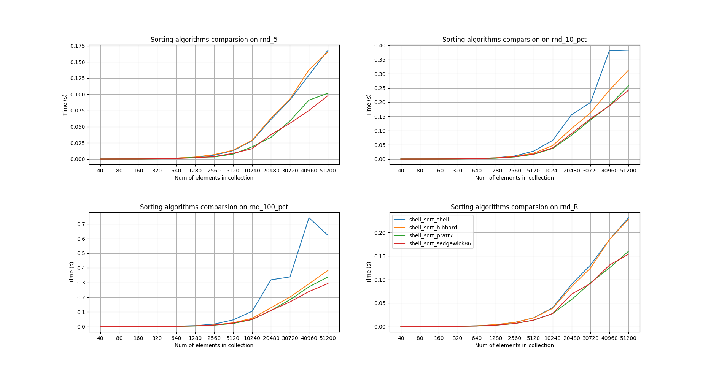
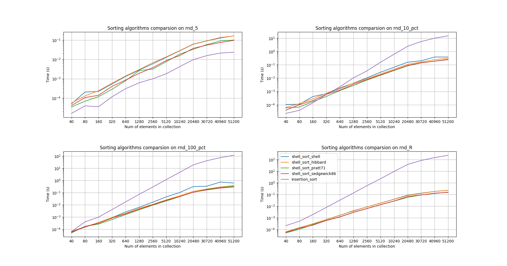

# HW05 otus-algorithms

Homework contains implementations of insertion sort and shell sort algorithms (with different gap algorithms)

### Install and run tests

#### Install and activate pipenv
```
$ git clone https://github.com/nekogda/otus-algorithms
$ cd otus-algorithms/05-sorting
$ pip3 install pipenv
$ pipenv install
```

#### run quick tests
```
$ pipenv run pytest --benchmark-skip
```
#### run benchmarks
```
$ pipenv run pytest --benchmark-json=results.json
```
#### plot results
```
$ pipenv run python make_plot.py -h  # for other options
$ pipenv run python make_plot.py results.json 
```

### Results




#### Num of items 1280. Reversed sequence. Worst case.
```
------------------------------------------------- benchmark 'dataset_name=1280_rnd_R': 5 tests ------------------------------------------------
Name (time in ms)                                                                         Min                 Max                Mean          
-----------------------------------------------------------------------------------------------------------------------------------------------
test_bench_shsorts[shell_sort-_step_gen_pratt71-1280_rnd_R-dataset_value110]           2.5883 (1.0)        3.7346 (1.04)       3.0840 (1.0)    
test_bench_shsorts[shell_sort-_step_gen_sedgewick86-1280_rnd_R-dataset_value111]       2.8958 (1.12)       3.5848 (1.0)        3.0969 (1.00)   
test_bench_shsorts[shell_sort-_step_gen_shell-1280_rnd_R-dataset_value108]             3.8392 (1.48)       5.1261 (1.43)       4.3521 (1.41)   
test_bench_shsorts[shell_sort-_step_gen_hibbard-1280_rnd_R-dataset_value109]           3.8945 (1.50)       6.0451 (1.69)       4.6174 (1.50)   
test_bench_insorts[insertion_sort-1280_rnd_R-dataset_value27]                        136.2050 (52.62)    140.4672 (39.18)    137.9332 (44.73)  
-----------------------------------------------------------------------------------------------------------------------------------------------
```
#### Num of items 1280. Only five elements are shuffled. Best case.

```
--------------------------------------------------- benchmark 'dataset_name=1280_rnd_5': 5 tests ---------------------------------------------------
Name (time in us)                                                                          Min                   Max                  Mean          
----------------------------------------------------------------------------------------------------------------------------------------------------
test_bench_insorts[insertion_sort-1280_rnd_5-dataset_value24]                         606.3690 (1.0)        628.1680 (1.0)        617.9197 (1.0)    
test_bench_shsorts[shell_sort-_step_gen_pratt71-1280_rnd_5-dataset_value98]         1,835.8560 (3.03)     4,375.8120 (6.97)     2,762.6556 (4.47)   
test_bench_shsorts[shell_sort-_step_gen_sedgewick86-1280_rnd_5-dataset_value99]     1,886.1910 (3.11)     3,154.1220 (5.02)     2,150.7876 (3.48)   
test_bench_shsorts[shell_sort-_step_gen_shell-1280_rnd_5-dataset_value96]           2,775.8330 (4.58)     4,231.9440 (6.74)     3,154.0790 (5.10)   
test_bench_shsorts[shell_sort-_step_gen_hibbard-1280_rnd_5-dataset_value97]         2,924.8870 (4.82)     3,015.0750 (4.80)     2,981.7760 (4.83)   
----------------------------------------------------------------------------------------------------------------------------------------------------
```
#### Num of items 1280. 10% of elements are shuffled.

```
----------------------------------------------- benchmark 'dataset_name=1280_rnd_10_pct': 5 tests -----------------------------------------------
Name (time in ms)                                                                             Min                Max               Mean          
-------------------------------------------------------------------------------------------------------------------------------------------------
test_bench_shsorts[shell_sort-_step_gen_pratt71-1280_rnd_10_pct-dataset_value102]          2.7688 (1.0)       2.8942 (1.0)       2.8104 (1.0)    
test_bench_shsorts[shell_sort-_step_gen_sedgewick86-1280_rnd_10_pct-dataset_value103]      3.3413 (1.21)      4.0539 (1.40)      3.6105 (1.28)   
test_bench_shsorts[shell_sort-_step_gen_hibbard-1280_rnd_10_pct-dataset_value101]          3.9525 (1.43)      5.1919 (1.79)      4.3841 (1.56)   
test_bench_shsorts[shell_sort-_step_gen_shell-1280_rnd_10_pct-dataset_value100]            4.1755 (1.51)      5.5340 (1.91)      4.4833 (1.60)   
test_bench_insorts[insertion_sort-1280_rnd_10_pct-dataset_value25]                        10.0424 (3.63)     19.8448 (6.86)     13.4743 (4.79)   
-------------------------------------------------------------------------------------------------------------------------------------------------

```
