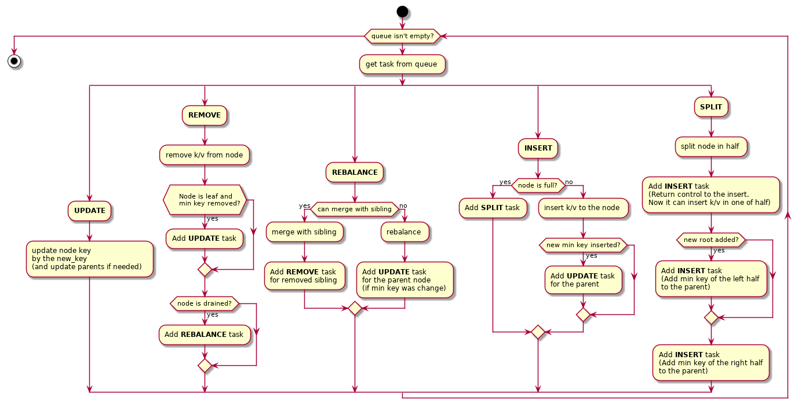

# Проектная работа: b+tree
Репозиторий содержит реализацию структуры данных b+tree на языке программирования rust.
### Install and run tests
#### clone repository
```
$ git clone https://github.com/nekogda/otus-algorithms
$ cd otus-algorithms/11-btree/btree-rs
$ rustup default stable
```

#### run tests
```
$ ./btree-test.sh
```

#### benchmark test
```
$ cargo bench --jobs 1 --all
```

### Описание
В качестве проекта было решено реализовать disk-based b+tree.
При реализации структуры, подразумевалось, что объем оперативной памяти машины ограничен.
Индекс, построенный с использованием этой структуры данных не сможет поместиться в памяти.
В связи с этим, стуктура должна располагаться на диске и ее элементы подгружаться в память по необходимости.

Данная реализация предоставляет следующие базовые операции на структуре:
- `insert`: добавление нового ключа/значения
- `remove`: удаление значения по ключу
- `find`: поиск значения по ключу

Кроме этого определены следующие вспомогательные операции:
- `new`: создание новой структуры по указанному пути
- `load`: отрытие/загрузка ранее созданного дерева из файла
- `compact`: операции уплотнения, для удаления неиспользуемых блоков
- `flush_cache`: в реализации используется кеш (lru) для часто используемых узлов дерева. Данная операция предназначена для его сброса

### Базовый сценарий работы со структурой
#### Создание
На первом этапе вызывается конструктор new. В качестве аргументов передаются:
- `path`: путь к файлу, который будет создан и в котором будут размещаться данные структуры
- `block_size`: размер блока (оптимальный размер для конкретного блочного устройства)
- `alpha`: коэффициент заполнения узла: 1/alpha. Alpha может принимать значения 2 и более. Например, 2 означает, что при уменьшении коэффициента ветвления узла до значений меньших 1/2, от максимально возможного, будет выполнена операция слияния с соседним узлом.
- `cache_size`: 0 - для отключения кеша, 1 и более - кол-во кэшируемых узлов.

В стуктуре вычисляются и поддерживаются три дополнительных параметра:
- `min_degree`: минимальная степень ветвления в узле. При заничении degree меньше этого, будет вызвана операция слияния узлов
- `max_degree`: максимальное кол-во ссылок в одном узле. При привышении этого значения, будет вызвана операция разделения узла
- `degree`: текущее кол-во ссылок из данного узла. Min и max вычисляются исходя из рамера блока и коэффициента заполнения alpha.

По завершнии работы конструктора мы получим структуру btree, на которой сможем выполнять операции.
Конструктор, в свою очередь, создаст в файловой системе новый файл. Первый блок будет зарезервирован под заголовок структуры. Во втором блоке будет размещен корневой узел дерева.
Заголовок содержит метаданные, которые должны в последующем обеспечить возможность загрузки файла.
Например, адрес блока с корневым узлом, рамер блока и т.д.
После того, как экземпляр структуры создан, мы можем вызывать на нем операции вставки/удаления/поиска.

#### Вставка
Операция вставки начинается с поиска подходящего листового узла. Далее проверяется наличие доступного в нем места для размещения пары ключ/значение. Если места не достаточно - вызывается операция split, которая разделяет запоненный узел на два и тем самым освобождает место для вставки.

#### Поиск
Поиск начинается с корневого узла. На каждом шаге достаетя очередной блок данных и в нем выполняется поиск c целью нахождения адреса следующего блока. Поиск внутри узла бинарный.

#### Удаление
Для удаления ключа/значения из дерева, выполняется поиск нужного листового узла и удаление пары ключ/значение из него.
После удаления производится проверка емкости узла и если в узле осталось меньше элементов, чем минимально допустимое, вызываются операции слияния/ребалансировки. Если произошло слияние с соседом, опустевший блок не удаляется. Структура просто забывает о нем. Таким образом, во время работы, в файле будут накапливаться блоки, которые занимают место, но не могут быть использованы и не возвращаются в файловую систему.
Для освобождения данных блоков существует операция compact. Она уплотняет используемые блоки в файле и подрезает его с конца, тем самым возвращая неиспользованное место в файловую систему.

### Task Manager

По идеологическим соображениям было решено отказаться от использования рекурсивных вызовов при реализации проекта. Поэтому основные операции декомпозированы и представлены в виде небольших тасков.
В целом процесс обработки операций удаления и вставки чем-то напоминает паттерн manager/worker.
TaskManager берет очередную задачу из очереди и передает ее на выполнение ответственной за задачу функции. Функция во время обработки задачи может добавить новые таски в очередь. Таким образом TaskManager обрабатывает все задачи из очереди, пока очередь не опустеет.

#### Общая схема работы Task Manager:



### Cache LRU
В данной реализации узел, который храниться в файловой системе и узел, который загружен в память процесса, могут иметь разное состояние.
В связи с этим, при изменении узла в памяти, необходимо также поменять его и в файловой системе.
Это довольно сильно снижает производительность из-за многочисленных операций flush и возникающего по этой причине ввода-вывода. Для снижения кол-ва i/o операций было решено применить кеш для узлов. Изменения сбрасываются в файловую систему: вручную, путем вызова flush_cache или автоматически, когда узел вытесняется из кеша более новым.


### Benchmarks
80 процентов операций find, 20% операций remove.
Операции в случайном порядке. Размер блока 512b.
```
N = 10000, cache_size =     0, Elapsed time:   4326 ms
N = 10000, cache_size =     1, Elapsed time:   3971 ms
N = 10000, cache_size =    10, Elapsed time:   3711 ms
N = 10000, cache_size =   100, Elapsed time:   2039 ms
N = 10000, cache_size =  1000, Elapsed time:     11 ms
```

### Предложения по улучшению
- убрать сериализацию/десериализацию и собирать вектор из ссылок на mmap (from raw parts/pointer)
- добавить журналирование для обеспечения целостности данных
- добавить хеш-функцию для данных и использовать хеш в качестве ключа
- добавить обратные ссылки на листовых нодах и сделать double-ended итератор O(N) по всем элементам
